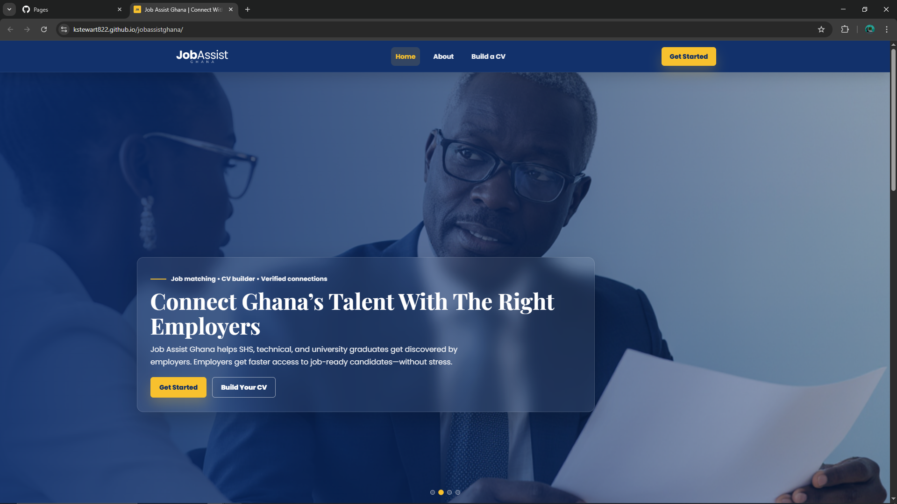
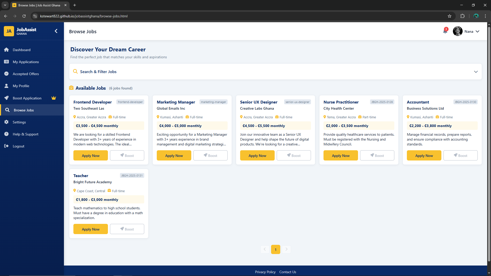
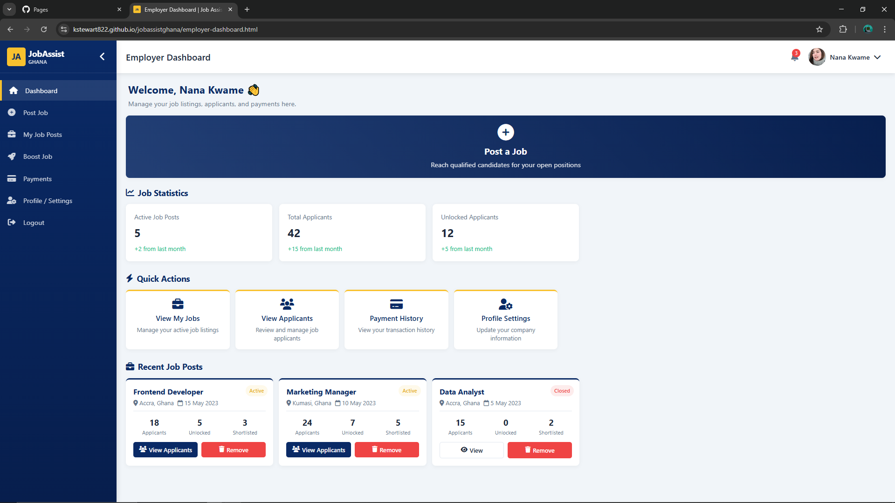

# Job Assist Ghana

## Live Demo

https://kstewart822.github.io/jobassistghana/

## Screenshots

### Home Page

### Browse Jobs

### Dashboard

Job Assist Ghana is a multi-page web application built to connect **job seekers** with **employers** in Ghana.  
This repository currently contains the **frontend (HTML/CSS/JS)** implementation.

---

## What the platform includes

### Job Seekers (Candidates)
- Browse and view job listings
- Apply for jobs
- Track applications
- Build and download a CV (PDF)
- Manage candidate profile and settings

### Employers
- Create employer accounts
- Post and manage job listings
- View applicants
- Boost job visibility
- Pay for promotions (Paystack integration)

---

## Tech Stack
- HTML5
- CSS3
- JavaScript (Vanilla)
- Paystack (payments)
- jsPDF (CV export)
- AOS / Font Awesome (UI)

---

## Project Structure

Job_Assist/
|- index.html # Main landing page
|- about.html
|- login.html
|- candidate/candidate-dashboard.html
|- employer/employer-dashboard.html
|- employer/post-job.html
|- build-cv.html
|- payment.html
- (many other pages)

---

## Run Locally

### Option A: VS Code Live Server (Recommended)
1. Open the project folder in VS Code
2. Install the extension **Live Server**
3. Right-click `Job_Assist/index.html`
4. Click **Open with Live Server**

### Option B: Open directly
You can open `Job_Assist/index.html` in your browser (some features may work better using Live Server).

---

## Documentation (Developer Handover)
A detailed handover document for continuing development is available here:

- `docs/DOCUMENTATION.md`

---

## Roadmap

Planned next steps for backend integration, authentication, payments, and platform growth are documented here:

- `docs/NEXT_STEPS.md`

## Backend Requirements

Backend expectations, API contracts, roles, payment rules, and MVP milestones are documented here:

- `docs/BACKEND_REQUIREMENTS.md`

## Status
- Frontend UI implemented
- Backend integration pending (authentication, database, APIs)

---

## License
MIT (recommended) - add a LICENSE file when ready.
